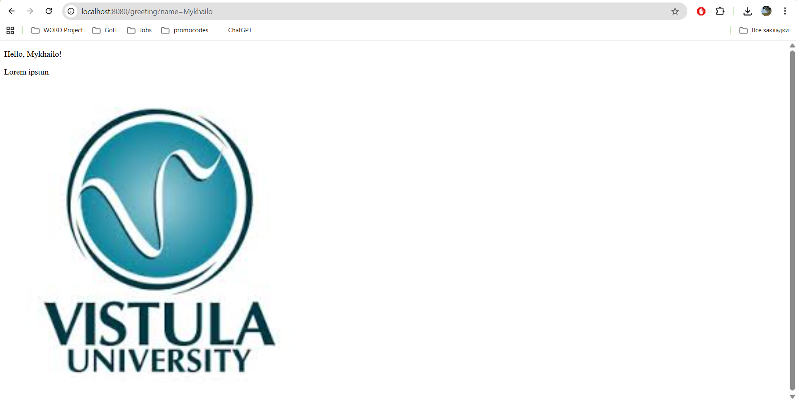

# Project 1 (Springboot)
This project is a simple Java Springboot application that has only 1 "HelloWorld-endpoint" which takes the name of the person to be greeted as a url-parameter and renders html template with the name of the person and also displays University logo.

# Getting Started
To get started you should clone this repository, run FirstJavaSpringProjectApplication file and open http://localhost:8080/greeting.
If you want to see your name on the page, you should provide it as a url-parameter (e.g. http://localhost:8080/greeting?name=Mykhailo)

Here is the example of an output you should get:

